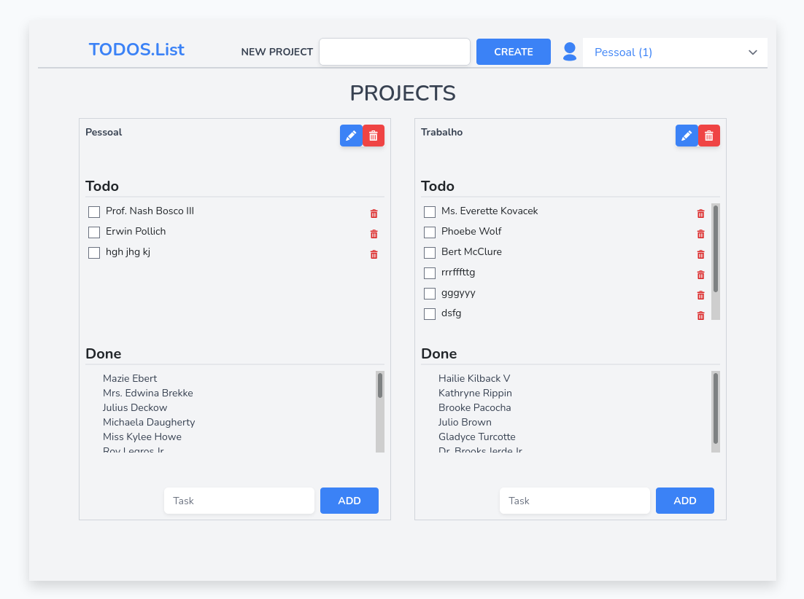

# Todos #

# Installation ##

## Instal composer (if you don't have it) ##

Laravel uses php8.0 - if don'n have it please install

## Install Laravel ##

I also have the laravel-ui, fruitcake/laravel-cors, laravel/sanctum and spatie/laravel-permission.
Please see the composer.json for the version and more.

## Install npn (or other ) ##

## Install React ##

and the dependencies you found in package.json

## Install the database #

# Configuration #

Configure the .env to suit your needs (password, database, ports ... etc.)

Create de dabase with your flavour of the database you choose.

Open a terminal and chnage to directory where your app is (supose it's todos).

Run

* php artisan migrate
* php artisan serve 
  ( I have the aplication running on my local machine )

Open other terminal in the same directory.

Run

* npm run watch
 
Go to a browser to the url (substitute 127.0.0.1:8000 for your locals)

 127.0.0.1:8000/register
 127.0.0.1:8000/login

## Notes ##

No use of versions. (No time but is easy)
The documentation for the api is in 127.0.0.1:8000/docs

Enjoy
